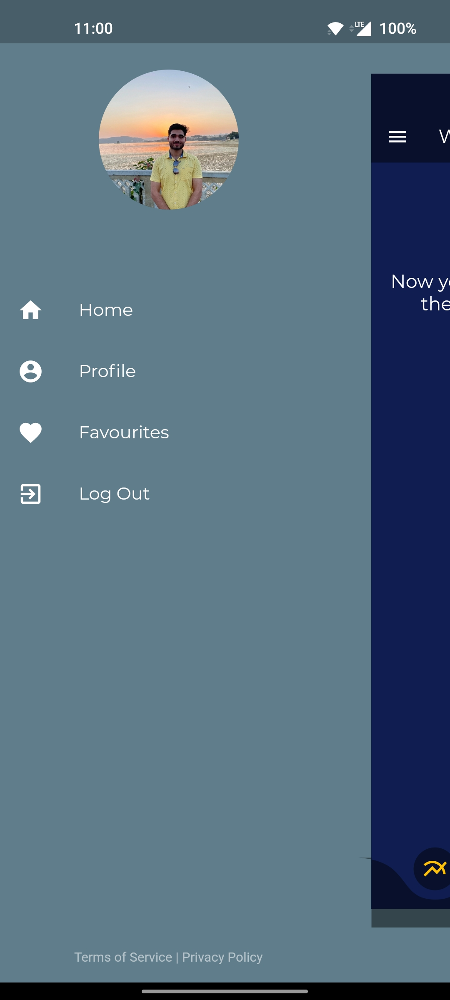

# MobiByte

- The MobiByte (MOBY) Crypto Mining App is a frontend application developed using Flutter and Firebase.
- It allows users to mine the hypothetical MobiByte cryptocurrency (MOBY) using their mobile devices.
- The app provides a user-friendly interface to easily participate in the mining process and track mining rewards.
- [📦.apk](https://github.com/Akshit1903/MobiByte/raw/main/app-release.apk) :For testing purposes
- [📽️YouTube](https://youtu.be/Vq0BWUgAImA) Video

## Screenshots



## Features

- Crypto Mining: Users can mine the MobiByte cryptocurrency (MOBY) directly from their mobile devices.
- Real-time Updates: Get live updates on mining progress, rewards, and mining statistics.
- Update Profile: Users can update their profile photo by images by gallery or camera.
- Referral System: Users, when referring another user will each get 20 MOBY.
- User-Friendly Interface: The app is designed to be intuitive and easy to use for both novice and experienced users.

## Technologies Used

- Flutter: A cross-platform UI toolkit for building natively compiled applications.
- Firebase: A comprehensive platform for developing mobile and web applications, providing various services such as authentication, database, and cloud storage.

## Installation

- Clone the repository:
  ```shell
  git clone https://github.com/Akshit1903/MobiByte
  ```
- Navigate to the project directory:
  ```shell
  cd MobiByte
  ```
- Install the required dependencies:
  ```shell
  flutter pub get
  ```
- Configure a device and run the app

  ```shell
  flutter run
  ```

  Alternativly, you can download `.apk` file from <a href="./app-release.apk"> here</a> and follow the steps:

- Launch the MobiByte Crypto Mining App on your mobile device.
- Sign in or create an account to participate in the mining process.
  - username- `akshit.lalit9@gmail.com`
  - password- `123456789`
- Start the mining process by clicking the "Start Mining" button.
- Monitor your mining progress and mining statistics in real-time.
- Stop the mining process at any time by clicking the "Stop Mining" button.
- Users can set/change their profile picture.
- By referral system, they can earn upto 20 MOBY each.

## Future Scope:

- Make settings page.
- Manage account history.
- Fix referrer rewards.
- Make a new DB in firebase to regain control.
